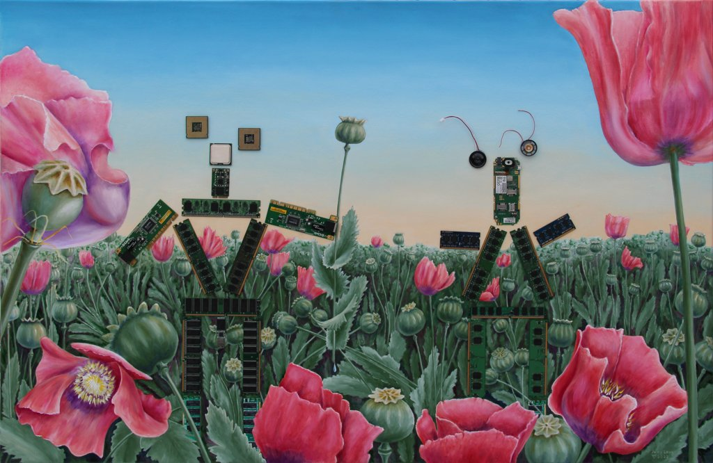

# Artworks related to information technology

## The Onion Bridge

2022-12-06 Oil on MDF, 31.1x19.1 in (79x48.5 cm)

The source of inspiration emerged in August 2022 when Tor was banned in Russia.
Out of curiosity I checked accessibility of non-public Tor bridges for a couple
of weeks, but eventually they were all banned.
Of course, new ones emerge sometimes, but paid fags in the service of enemy homeland
regularly find and ban them. I'm not paid for my curiosity so I gave a shit.

But then I started [dtcm](https://declassed.art/repository/dtcm/) project,
and then [torcontrol](https://github.com/declassed-art/torcontrol)
and [dtcm2](https://github.com/declassed-art/dtcm2), and when they became
production ready this painting was finished, at last.

## Juicy Love

2022-02-01 Oil on MDF, 48x31.3 in (122x79.5 cm)

Assemblage with electronic parts.

## 101+1 instance 1

2022-01-10 Oil on MDF, 44.5x15.4 in (113x39 cm)

Another instance of 101+1.

## Web Technologies

2021-12-04 (2012-2021) Oil on Canvas, 24x70.1 in (61x178 cm)

Heaven and Hell and crap in between with which we have to work.

## One Of These Days

2021-04-02 (2016-2021) Oil on Canvas on cardboard, 27.6x19.7 in (70x50 cm)

...I'm gonna cut you into little pieces (Pink Floyd, Meddle). And Minecraft, of course.

## @work

2021-04-30 Oil on MDF, 25x20.5 in (63.5x52 cm)

## 101+1

2021-04-20 Oil on MDF, 44.5x15.4 in (113x39 cm)

Keyboard for us, programmers, is our everything!

## RFC2549-RFC2979

2014-07-16 Oil on Canvas, 22.8x27.6 in (58x70 cm)

## Clinical Picture

2013-04-17 Oil on Canvas on Plywood, 22.8x27.6 in (58x70 cm)

That's what on our, programmer's, mind. Maybe, a whole universe. Unnaturally shaped. Or, maybe, just stars and the void.

## Software

2012-11-18 Oil on Canvas, 10.6x19.7 in (27x50 cm)

This seems to be the first my own painting after a couple of copies of Dali.
